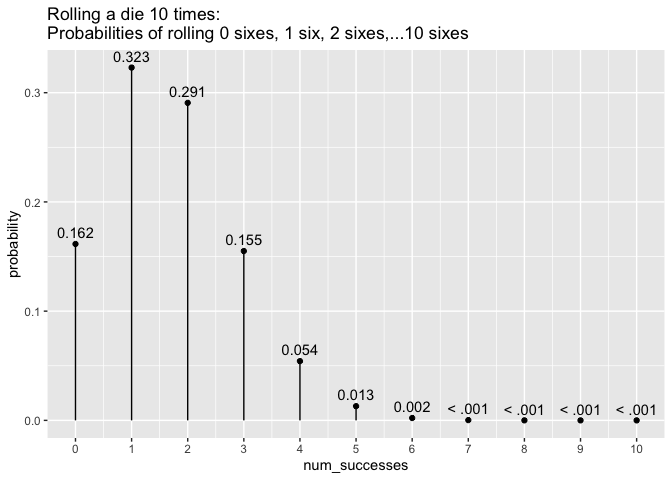
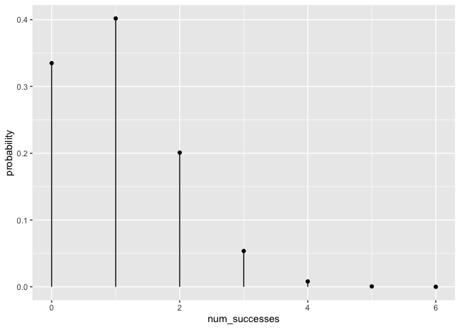
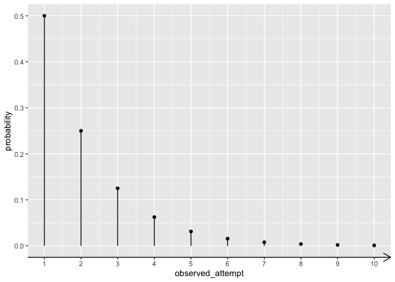
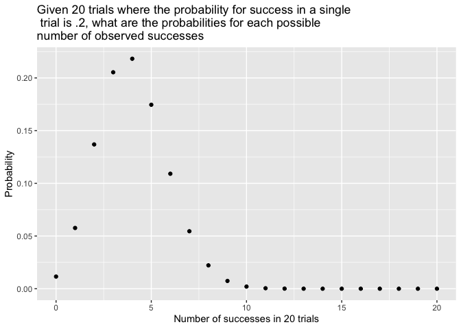

See also:

  - more learning materials:
    <https://github.com/EvaMaeRey/ay_2023_2_advanced_individual_study>
  - sibling project: <https://github.com/EvaMaeRey/ma206equations>

## Title

Easily visualize common distributions for statistical and probabilistic
analytics in ggplot2

## Abstract

Mathematical fluency involves frequent use of probability distributions.
However, visualizing these distributions can be tedious. In a fixed
statistics and probability curriculum, the set of distributions to be
mastered is well defined. In such settings having shortcuts to produce
or ingest these distributions in analytic software for display and
analysis could be beneficial for students and instructors alike. The
goal of this project is to provide ready-to-use objects (dataframes) and
functions that will meet students will make it easier to engage
computationally and with these distributions. We make these objects and
functions available in the R package `ma206distributions`.

## Which distributions are relevant for the statistics and probability course?

A good start for looking at the core of distributions in the ma206
course guide:

  - binomial
  - geometric
  - normal distribution
  - random

## Objectives

1.  Provide functions that return dataframes relating outcomes and
    probabilities for binomial and geometric distributions
2.  Providing quick-viz *stamp* functions for binomial and geometric
    distributions (normal and t exist in ggxmean); also think about
    rewrite for stamp\_normal (i.e. what should height distribution look
    like?)
3.  Provide additional **dataframes** for ma206 that are probabilities
    from curriculum (probability problems in text book).  
4.  Provide interactive app which 1) demonstrates distribution
    characteristics, allowing easy manipulation of parameters 2)
    connects to new package functionality by quoting back code
    underlying the app.

### 1\. provide data frames that relate outcomes and probabilities

We can look at vectors of outcomes, and then use dbinom to get back a
vector of probabilities.

``` r
num_successes <- 0:10; num_successes
```

    ##  [1]  0  1  2  3  4  5  6  7  8  9 10

``` r
dbinom(num_successes, prob = .5, size = 10)
```

    ##  [1] 0.0009765625 0.0097656250 0.0439453125 0.1171875000 0.2050781250
    ##  [6] 0.2460937500 0.2050781250 0.1171875000 0.0439453125 0.0097656250
    ## [11] 0.0009765625

``` r
library(ma206distributions)
# probability of number of heads in 10 coin flips
tidy_dbinom(single_trial_prob = .5, 10)
```

    ## # A tibble: 11 × 4
    ##    num_successes probability single_trial_prob num_trials
    ##            <int>       <dbl>             <dbl>      <dbl>
    ##  1             0    0.000977               0.5         10
    ##  2             1    0.00977                0.5         10
    ##  3             2    0.0439                 0.5         10
    ##  4             3    0.117                  0.5         10
    ##  5             4    0.205                  0.5         10
    ##  6             5    0.246                  0.5         10
    ##  7             6    0.205                  0.5         10
    ##  8             7    0.117                  0.5         10
    ##  9             8    0.0439                 0.5         10
    ## 10             9    0.00977                0.5         10
    ## 11            10    0.000977               0.5         10

``` r
# probabilities of rolling 0, 1, 2, 3 or 4 sixes in 4 die roles
tidy_dbinom(single_trial_prob = 1/6, 4)
```

    ## # A tibble: 5 × 4
    ##   num_successes probability single_trial_prob num_trials
    ##           <int>       <dbl>             <dbl>      <dbl>
    ## 1             0    0.482                0.167          4
    ## 2             1    0.386                0.167          4
    ## 3             2    0.116                0.167          4
    ## 4             3    0.0154               0.167          4
    ## 5             4    0.000772             0.167          4

``` r
# probability of 0, 1, 2 or 3 wins in 3 spins of a prize wheel  
# 12 pie slices, one with big payout
tidy_dbinom(1/12, 3)
```

    ## # A tibble: 4 × 4
    ##   num_successes probability single_trial_prob num_trials
    ##           <int>       <dbl>             <dbl>      <dbl>
    ## 1             0    0.770               0.0833          3
    ## 2             1    0.210               0.0833          3
    ## 3             2    0.0191              0.0833          3
    ## 4             3    0.000579            0.0833          3

### 2\. Stamp visualizations

``` r
library(ggplot2)
ggplot() + 
  geom_lollipop(data = tidy_dbinom(single_trial_prob = .5, 10),
                aes(x = num_successes, y = probability))
```

<!-- -->

``` r
stamp_dbinom <- function(single_trial_prob = .5, num_trials = 10){
  
  geom_lollipop(data = tidy_dbinom(single_trial_prob = single_trial_prob, 
                                   num_trials = num_trials),
                aes(x = num_successes, y = probability))
  
}


ggplot() + 
  stamp_dbinom()
```

<!-- -->

``` r
ggplot() + 
  stamp_dbinom(1/6, num_trials = 6)
```

<!-- -->

``` r
ggplot() + 
  stamp_dbinom(1/12, num_trials = 3)
```

<!-- -->

## 3\. Tidying data from discrete random variable probability problems

Tidying up data is important so that when the data is inputted into R or
any coding language. This process of ‘tidying’ data creates a
well-organized and structured format that is easier for data analysis
and visualization.

Probability tables are often communicated in untidy, wide forms not
easily ingested by statistical software. (another example:
<http://www.stat.yale.edu/Courses/1997-98/101/ranvar.htm#>:\~:text=A%20discrete%20random%20variable%20is,then%20it%20must%20be%20discrete)
For example, the table was provided for a probability problem about a
spinning wheel with pie sectors with various prize award amounts:

|              |          |        |        |
| :----------- | :------- | :----- | :----- |
| sector\_type | No Prize | Win $1 | Win $3 |
| frequency    | 9        | 1      | 2      |

The table summarized the situation:

<!-- -->

To get the data into a tidy, ready-to-use form, we transposed the table
from wide to long so that a variable is a columns and the column headers
inform us about the content. This way, each row forms an observation, in
this case an event type. The spinning of the prize wheel has three
outcomes based on which sector type the wheel landed on: no prize, win
$1, and win $3. We added a numeric column ‘payout’ too which we makes
the data easier to use from a mathematical standpoint. Below is our
tidied data.

| sector\_type | frequency | payout |
| :----------- | --------: | -----: |
| No Prize     |         9 |      0 |
| Win $1       |         1 |      1 |
| Win $3       |         2 |      3 |

In our package we include the data structured in this way, and call the
object `prize_wheel`:

``` r
library(ma206distributions)
print(prize_wheel)
```

    ##   sector_type frequency payout
    ## 1    No Prize         9      0
    ## 2      Win $1         1      1
    ## 3      Win $3         2      3

We see that we can easily visualize the joint distribution of payout and
frequency using the ggplot2 tool that is used heavily in the statistics
part of the class.

``` r
library(tidyverse)
prize_wheel %>% 
  ggplot() + 
  aes(x = payout) + 
  aes(y = frequency) +
  geom_lollipop() + 
  aes(weight = frequency) +
  geom_fulcrum(color = "red", 
               shape = 2, size = 5)
```

<!-- -->

# The tabular data can also be used to walk through computations, like finding the expected value of the prize wheel spin.

``` r
sum(prize_wheel$payout *
  prize_wheel$frequency) /
  sum(prize_wheel$frequency)
```

    ## [1] 0.5833333

``` r
library(tidyverse)
library(ggxmean)

ggxmean:::stamp_space() + 
  stamp_normal_dist()
```

<!-- -->

# Project timeline

| Timing      | Activity and Deliverable                                                                             | Hours |
| ----------- | ---------------------------------------------------------------------------------------------------- | ----- |
| 0-3 weeks   | Background on writing functions in R and package architecture                                        | 15    |
| 3-6 weeks   | ggplot2 programming basics                                                                           | 15    |
| 6-10 weeks  | Building functionality easily visualizing probability distributions (normal, t, binomial, geometric) | 15    |
| 10-12 weeks | Showcasing and soliciting feedback                                                                   | 15    |
| 12-15 weeks | Incorporating feedback                                                                               | 10    |
| Final       | Report and presentation.                                                                             | 10    |

# Some initial code ideas…

Below, we do some of the visualization with base R and base ggplot2. The
aim is to provide code that feels much more effortless and fun to use to
visualize distributions.

## Visualizing a binomial distribution without {ma206distributions} functions

The equations in the plot were produce in the following fashion (no
functions or package pre-built):


``` r
library(tidyverse)


latex2exp::TeX("${{_N}C{_k}} \\cdot p^kq^{N-k}$")
```

    ##    LaTeX: ${{_N}C{_k}} \cdot p^kq^{N-k}$ 
    ## plotmath: {{{}[N]}*C * {{}[k]}} %.% p^{k}*q^{N - k}

``` r
single_trial_prob <- .5
num_trials <- 10
0:num_trials ->
  possible_outcomes
dbinom(x = possible_outcomes,
       size = 10,
       prob = single_trial_prob) ->
  probs
tibble(possible_outcomes, probs) %>%
  ggplot() +
  aes(x = possible_outcomes) +
  scale_x_continuous(breaks = possible_outcomes) +
  aes(y = probs) +
  geom_point(fill = "white") +
  aes(xend = possible_outcomes,
      yend = 0) +
  geom_segment() +
  labs(subtitle = "Course idea #0: For multiple trials, the probability of a certain number of successes..." %>%
         str_wrap(60),
       x = "Number of Successes in 10 trials",
       y = "Probability") +
  geom_text(aes(label = probs %>% round(4)),
            nudge_y = .01) + 
    annotate(geom = "text",
    x = 1.5,
    y = .2,
    label = "{{{}[N]}*C * {{}[k]}} %.% p^{k}*q^{N - k}",
    parse = TRUE,
    size = 5) ->
    binomial_distribution

binomial_distribution
```

<!-- -->

Another possibility is using the `stat_function()` function in ggplot2
to produce visualizations of a binomial distribution. Below, we show how
you can visualize the binomial distribution for 20 trials and .2 is the
probability of success for each trial. Using the `stat_function()`
carefully, you can get a similar outcome. However, there is a lot of
coordination that’s required: `20` shows up about three times in the
construction for example in xlim(); in `n = 21` (20 + 1 possible
outcomes); and finally in the `args` list. Producing this plot requires
a lot of foreknowledge. With our alternative strategies, (delivering
data frames and stamps), we hope to give students something they can
produce easily, and *then* have a conversation about why the
distribution has the form it does.

``` r
library(ggplot2)
ggplot() + 
  xlim(0, 20) +
  stat_function(fun = dbinom,
                geom = "point", 
                n = 21,
                args = list(size = 20, prob = .2)) + 
  labs(y = "Probability") + 
  labs(x = "Number of successes in 20 trials") + 
  labs(title = "Given 20 trials where the probability for success in a single\n trial is .2, what are the probabilities for each possible\nnumber of observed successes ")
```

<!-- -->

## Visualizing a Discrete Random Variable without {ma206distributions} functions

Probability problems could be structured as data frames visualized with
the same tools used in the stats part of the class.

``` r
tibble(event = c("totaled", "fender bender", "accident free"),
       probability = c(.01, .09, .9),
       payout = c(20000, 5000, 0)) ->
expected

plotmath_ev <- latex2exp::TeX("$E[X] = x_1p_1 + x_2p_2 + x_3p_3 ...x_np_n = \\sum_1^n{x_ip_i}$")

plotmath_var <- latex2exp::TeX("$Var(X) = E[(X-\\mu)^2] = \\sigma^2_x = \\sum_1^n(x_i-\\mu)^2p_i$")

plotmath_sd <- latex2exp::TeX("$\\sigma_x = SD(X) = \\sqrt{Var(X)}$")


expected %>% 
  ggplot() + 
  aes(x = payout, y = probability) + 
  geom_point() + 
  geom_segment(aes(xend = payout, yend = 0)) + 
  geom_text(aes(label = probability), size = 5, 
            vjust = -.5, color = "black") + 
  geom_fulcrum(aes(weight = probability)) + 
  geom_vline(xintercept = sum(c(.01*20000, .09*5000)),
             linetype = "dashed", color = "black") + 
  labs(subtitle = "Course idea 8:  The expected value E.V. is the 'balancing point' of a Random variable, X.  It is the weighted average of values, (weighting values by their probabilities). In large samples from the X, the average will be close to the E.V.;" %>% str_wrap(60)) + 
  annotate(geom = "label", x =sum(c(.01*20000, .09*5000)), label = sum(c(.01*20000, .09*5000)), y = .5 ) + 
  scale_y_continuous(limits = c(0,1)) + 
  annotate(geom = "text", label = plotmath_ev, parse = T,
           x = 12000, y = .95) +
  annotate(geom = "text", label = plotmath_var, parse = T,
           x = 12000, y = .8) +  
  annotate(geom = "text", label = plotmath_sd, parse = T,
           x = 12000, y = .65) ->
discrete_random
```

    ## Warning in geom_fulcrum(aes(weight = probability)): Ignoring unknown
    ## aesthetics: weight

``` r
discrete_random
```

    ## Warning in is.na(x): is.na() applied to non-(list or vector) of type
    ## 'expression'

    ## Warning in is.na(x): is.na() applied to non-(list or vector) of type
    ## 'expression'
    
    ## Warning in is.na(x): is.na() applied to non-(list or vector) of type
    ## 'expression'

<!-- -->

See also:

  - <https://evamaerey.github.io/mytidytuesday/2022-08-01-dbinom-dgeom/dbinom_dgeom.html>
  - <https://evamaerey.github.io/mytidytuesday/2022-08-01-dbinom-dgeom/dbinom_dgeom_flipbook.html>

# Architechture we will use

### How do we bundle up our work into concept-sized usable bits? Functions.

### How do we bundle up related functions? Packages.

  - We will still follow the steps outlined in this data package readme:
    <https://github.com/EvaMaeRey/tidytitanic>
  - As well as consult the package building guide:
    <https://evamaerey.github.io/package_in_20_minutes/package_in_20_minutes>

### How do we collaborate and share the package? Version Control…

  - create a github account for collaboration <https://github.com/>
  - we’ll make the repository available in this account
